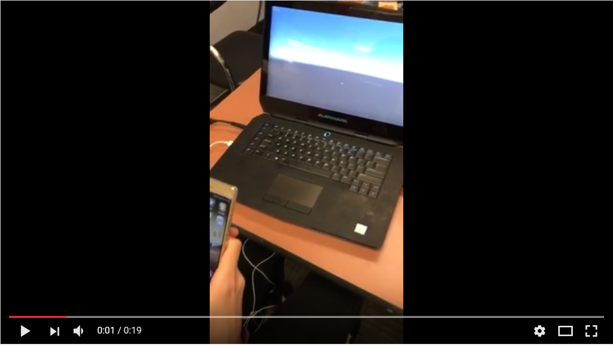
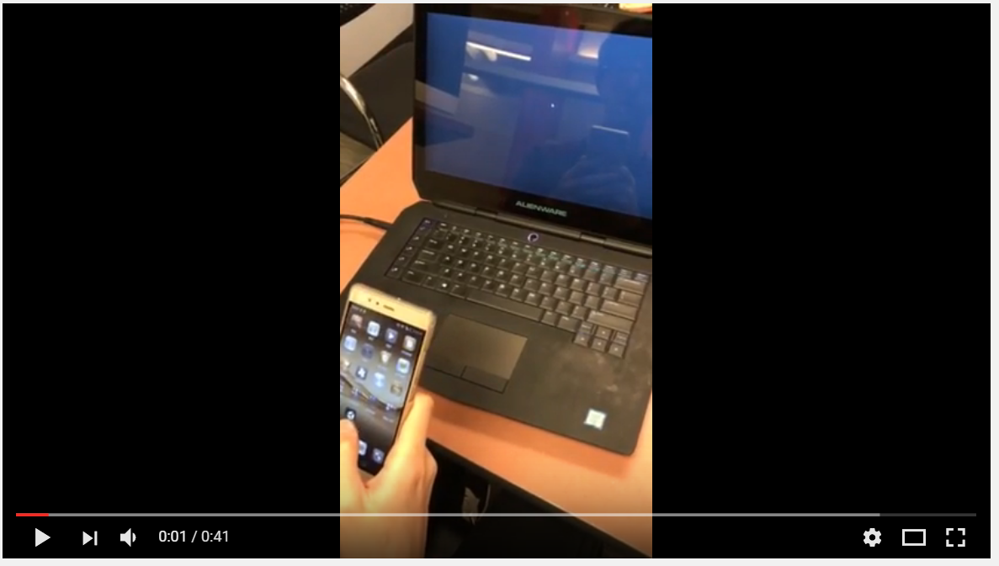

# AR-PaintBall-Unity-Android
`Unity3D` `C#` `Android` `AR`

# Description
* Cube:
  use Photon to connect the phone and PC, and use the gyroscope to control a cube on the PC screen.
* PaintBall:
  paint splatter game using Unity, the gyroscope input, Photon and Vuforia
  
# Demo Video
* Cube:
  
* PaintBall:
  
